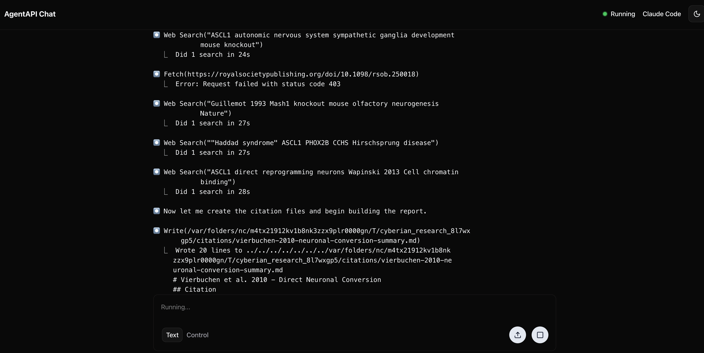

# Ralph Wiggum Tries His Hand at Research

*Autonomous AI loops, iterative research, and watching your agent think*

*Also published on [dev.to](https://dev.to/cmungall/ralph-wiggum-tries-his-hand-at-deep-research-2mdf)*

---


*Figure: Ralph prepares for his literature review. Artist's impression.*

If you've been anywhere near the Claude Code discourse lately, you've probably encountered the "Ralph Wiggum loop"—a technique that went viral in late 2025 and has since been canonized as an [official Claude Code plugin](https://github.com/anthropics/claude-code/tree/main/plugins/ralph-wiggum). The idea is simple. As [Geoffrey Huntley](https://ghuntley.com/ralph/) puts it:

> "Ralph is a Bash loop."

```bash
while :; do cat PROMPT.md | claude-code ; done
```

That's it. Feed Claude a prompt. Let it work. When it exits, feed it the same prompt again. Claude sees its previous work—the modified files, its own git commits—and iterates. The loop creates a self-correcting feedback system that can run for hours without human intervention.

The name comes from [Ralph Wiggum](https://en.wikipedia.org/wiki/Ralph_Wiggum), the perpetually confused child from *The Simpsons* who never stops trying despite consistent failure. Huntley's philosophy: "Better to fail predictably than succeed unpredictably." Let the agent iterate toward correctness rather than demanding perfection on the first attempt.

## Ralph Tries Research

So Ralph can code. But can he do a literature review?

The [cyberian](https://github.com/monarch-initiative/cyberian) provider in [deep-research-client](https://github.com/monarch-initiative/deep-research-client) runs a similar autonomous loop, but instead of iterating on code until tests pass, it iterates on research until the literature is exhausted. The workflow is defined in [deep-research.yaml](https://github.com/monarch-initiative/deep-research-client/blob/main/src/deep_research_client/workflows/deep-research.yaml):

```yaml
subtasks:
  initial_search:
    instructions: perform deep research on {{query}}.
      # ... creates PLAN.md, REPORT.md, citations/ ...

  iterate:
    instructions: Keep on researching {{query}}, following the plan...
    loop_until:
      status: NO_MORE_RESEARCH
      message: If you think all research avenues are exhausted,
        yield status NO_MORE_RESEARCH
```

The agent:

1. Creates a research plan
2. Searches, downloads papers, extracts text
3. Maintains a narrative report (not bullet points—*prose*, like a review article)
4. Tracks a citation graph showing how papers relate
5. **Loops back** to continue researching until it decides it's done

Same pattern: iteration until completion, with the agent observing its own previous work and refining. The difference is that instead of git history as the feedback mechanism, research-Ralph accumulates findings in a structured workspace (`PLAN.md`, `REPORT.md`, `citations/`).

## Watching Ralph Think

Most "deep research" services are black boxes. You submit a query, wait, and receive a result. OpenAI's deep research, Perplexity Pro—you have no visibility into the process. Did it miss an obvious source? Is it stuck? Is it even still running?

The cyberian provider uses [agentapi](https://github.com/coder/agentapi) to bridge to local AI agents. Agentapi exposes a chat interface, which means you can watch Ralph work in real-time:

```
http://localhost:3284/chat
```


*Figure: The agentapi chat interface at localhost:3284 (default for Cyberian), showing Ralph mid-literature-review. You can see his searches, his reasoning, and the citations accumulating in real-time.*


This turns out to be useful. You can see:

- What searches the agent is performing
- Which papers it's finding (and which it's missing)
- How it's reasoning about the literature
- When it's going down an unproductive path
- Failure points - e.g. lacking access to download full texts
- The actual citation files being created

It transforms deep research from "fire and forget" to "pair researching with an AI assistant." You can even intervene—though usually you won't need to.
Additionally, you can use tools like [ai-blame](https://ai4curation.io/ai-blame/) to mine traces.

## Configuration

To use the cyberian provider:

```bash
deep-research-client research \
    "What are the molecular mechanisms of autophagy in neurodegeneration?" \
    --provider cyberian
```

Or via the Python API:

```python
from deep_research_client import DeepResearchClient

client = DeepResearchClient()
result = client.research(
    "What are the molecular mechanisms of autophagy in neurodegeneration?",
    provider="cyberian"
)
```

Requirements:
- The `cyberian` Python package installed
- `agentapi` binary in your PATH
- A local agent (Claude Code, Aider, Cursor, or Goose)

The default timeout is 30 minutes. This is not a typo. Thorough research takes time—the agent is doing actual literature search, downloading papers, reading them, synthesizing findings. The Ralph Wiggum philosophy applies: let it iterate.

One nice thing about the cyberian approach: since it works through agentapi, you're not locked into any particular model or provider. Claude Code with Anthropic models works best (we would say that), but if you prefer Aider with GPT-4 or Cursor with whatever they're running this week, the same workflow runs. Ralph is agent-agnostic.

## I'm Learnding

The Ralph pattern isn't complicated. Complex tasks benefit from iteration. LLMs are better at correcting their mistakes than avoiding them.

For code: write, test, fail, fix, repeat.

For research: search, read, synthesize, find gaps, repeat.

The cyberian workflow predates the "Ralph Wiggum" meme—we just called it "iterative deep research" because we're boring academics. But it's the same idea: let the agent loop until the work is done.

Now, when you run `provider="cyberian"`, you can picture Ralph in there, earnestly accumulating citations until he runs out of papers to read.

You can even peer inside his head while he works.

---

## References

- [Geoffrey Huntley - Ralph Wiggum as a "software engineer"](https://ghuntley.com/ralph/)
- [Claude Code Ralph Wiggum Plugin](https://github.com/anthropics/claude-code/tree/main/plugins/ralph-wiggum)
- [The Ralph Wiggum Approach - DEV Community](https://dev.to/sivarampg/the-ralph-wiggum-approach-running-ai-coding-agents-for-hours-not-minutes-57c1)
- [cyberian - Monarch Initiative](https://github.com/monarch-initiative/cyberian)
- [deep-research-client - Monarch Initiative](https://github.com/monarch-initiative/deep-research-client)
- [agentapi - Coder](https://github.com/coder/agentapi)
